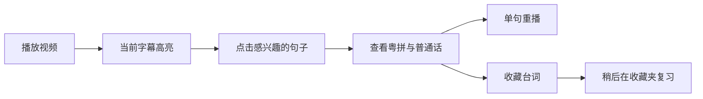
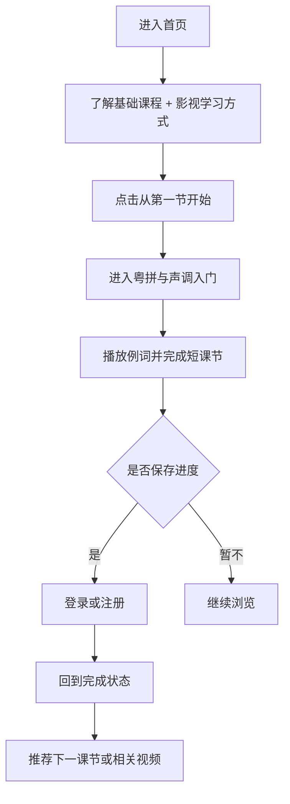
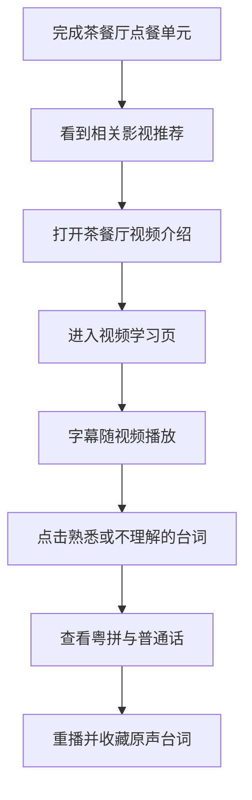
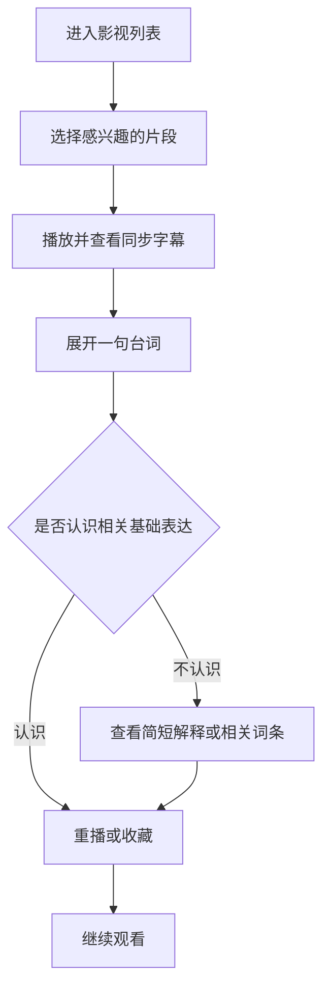
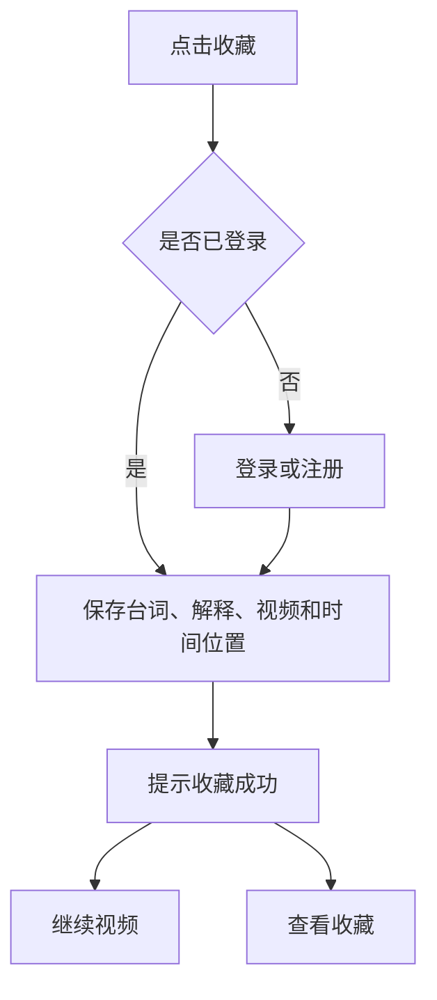
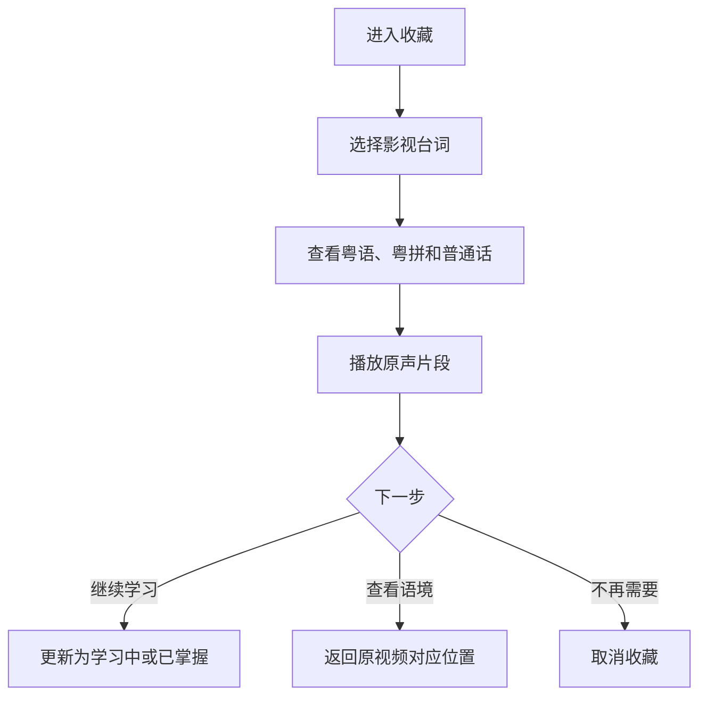
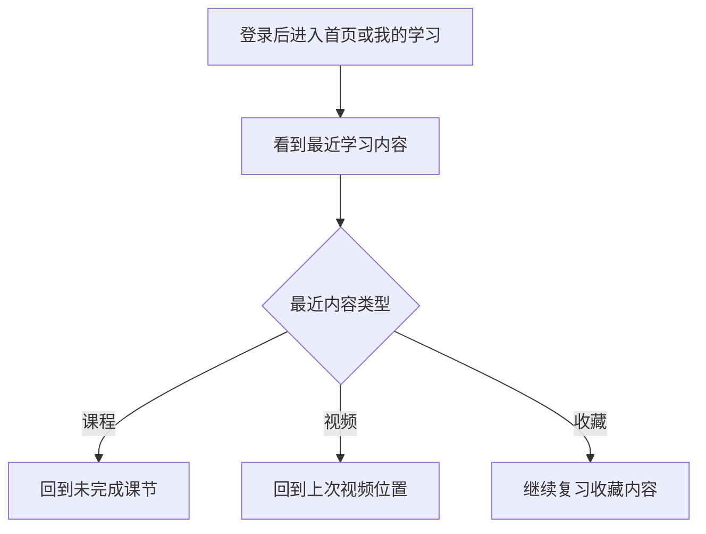

# 粤见 CantoScene｜信息架构与用户流程

> 文档状态：初稿  
> 依赖文档：《01-产品定义》《02-MVP-PRD》《03-课程与内容规范》  
> 本文用途：确定网站页面结构、导航关系和 MVP 核心用户路径

## 1. 设计目标

网站结构需要帮助用户快速回答三个问题：

1. 我应该从哪里开始学？
2. 我现在学到哪里了？
3. 我刚才喜欢的粤语台词去哪里找？

整体结构不按照“词典、工具、AI”等能力堆叠入口，而按照用户的学习过程组织：

> 建立基础 → 进入真实影音 → 收藏有用表达 → 回来复习

## 2. 一级导航

MVP 用户侧采用五个主要入口：

| 一级入口 | 主要作用 | 主要用户 |
|---|---|---|
| 首页 | 了解产品、开始或继续学习 | 所有用户 |
| 基础课程 | 学习粤拼、高频字词和生活场景 | 初学者 |
| 影视学粤语 | 通过真实视频逐句学习 | 所有学习用户 |
| 收藏 | 回顾收藏的台词和课程字词 | 登录用户 |
| 我的学习 | 查看进度、最近学习和统计 | 登录用户 |

账号、简繁切换等属于全局操作，不占用一级学习导航位置。

### 2.1 导航显示原则

- 电脑端可以在顶部完整展示主要入口；
- 移动端保留最常用入口，其他操作集中到个人菜单；
- 当前所在模块要有清楚的选中状态；
- “开始学习”和“继续学习”是行动按钮，不额外成为一级栏目；
- 管理后台不出现在普通用户导航中。

## 3. 全站页面结构

```mermaid
flowchart TD
    HOME["首页"]
    COURSE["基础课程"]
    COURSE_LIST["课程列表"]
    COURSE_DETAIL["单元介绍"]
    LESSON["课节学习"]
    JYUTPING["粤拼发音速查"]
    WORDS["高频粤语字词"]
    VIDEO["影视学粤语"]
    VIDEO_LIST["视频列表"]
    VIDEO_DETAIL["视频介绍"]
    VIDEO_STUDY["视频学习页"]
    FAVORITES["收藏"]
    FAVORITE_DETAIL["收藏内容详情"]
    MY["我的学习"]
    LOGIN["登录与注册"]
    SETTINGS["账号与显示设置"]

    HOME --> COURSE
    HOME --> VIDEO
    HOME --> MY
    COURSE --> COURSE_LIST
    COURSE --> JYUTPING
    COURSE --> WORDS
    COURSE_LIST --> COURSE_DETAIL
    COURSE_DETAIL --> LESSON
    LESSON --> VIDEO_DETAIL
    VIDEO --> VIDEO_LIST
    VIDEO_LIST --> VIDEO_DETAIL
    VIDEO_DETAIL --> VIDEO_STUDY
    VIDEO_STUDY --> FAVORITES
    FAVORITES --> FAVORITE_DETAIL
    FAVORITE_DETAIL --> VIDEO_STUDY
    MY --> LESSON
    MY --> VIDEO_STUDY
    MY --> FAVORITES
    HOME --> LOGIN
    LOGIN --> MY
    MY --> SETTINGS
```

## 4. 首页

### 4.1 页面目标

首页不是内容大杂烩，而是帮助用户理解产品并进入最合适的下一步。

### 4.2 未登录用户首页

按照以下顺序组织内容：

1. **一句话价值说明**：通过基础课程和真实视频学习香港粤语；
2. **主要行动入口**：从第一节开始／体验影视学习；
3. **核心学习方式展示**：字幕、粤拼、普通话和原声收藏；
4. **入门课程预览**：展示首批三个单元；
5. **影视内容预览**：展示少量精选片段；
6. **账号提示**：登录后可以保存进度和收藏。

### 4.3 已登录用户首页

登录后首页重点发生变化：

1. 最突出位置展示“继续学习”；
2. 展示最近课程或视频；
3. 推荐一个与当前课程相关的视频；
4. 提醒最近收藏但尚未掌握的表达；
5. 保留进入全部课程和全部视频的入口。

首页只展示少量个人学习摘要，完整进度仍然放在“我的学习”。

## 5. 基础课程模块

### 5.1 基础课程首页

基础课程首页包含三个区域：

1. **入门学习路线**：按顺序展示三个课程单元；
2. **基础工具**：粤拼发音速查；
3. **高频内容**：高频粤语字词。

情景对话属于课程内部内容，不作为单独栏目出现。

### 5.2 课程列表

每个单元展示：

- 单元名称；
- 可以学会什么；
- 简短场景说明；
- 课节数量；
- 未开始、学习中或已完成状态；
- 开始或继续按钮。

### 5.3 单元介绍页

进入正式学习前，让用户看到：

- 本单元学习目标；
- 使用场景；
- 将学习的部分核心表达；
- 预计学习量；
- 开始或继续课节的入口；
- 相关影视片段预告。

### 5.4 课节学习页

课节按内容顺序呈现：

> 场景引入 → 核心字词 → 核心句型 → 情景对话 → 基础练习 → 本课总结

页面需要长期保留三个辅助操作：

- 播放当前字词或例句；
- 收藏当前字词；
- 在需要时进入粤拼速查。

完成课节后，引导进入下一课节；完成整个单元后，优先推荐使用了本单元表达的影视片段。

### 5.5 粤拼发音速查页

页面按照声母、韵母和声调分区。用户可以：

- 点击一个发音项目；
- 查看代表字词；
- 播放发音与例词；
- 查看简短发音提示；
- 返回原来的课程位置。

从课程中打开速查时，应保留用户原来的学习位置，避免查询后找不到刚才内容。

### 5.6 高频粤语字词页

首版主要承担浏览和基础查询：

- 展示 30～50 个高频字词；
- 每个词条展示粤语、粤拼和核心释义；
- 点击词条查看例句、使用提示和相关内容；
- 点击词语或例句分别播放对应发音；
- 可以收藏词条；
- 可以进入出现过该表达的课程或影视片段。

首版内容数量较少，不加入复杂搜索和多条件筛选。

## 6. 影视学粤语模块

### 6.1 视频列表页

视频列表让用户按兴趣选择内容。每个视频展示：

- 封面和标题；
- 简短场景说明；
- 场景标签；
- 难度；
- 大致长度；
- 未观看、观看中或已完成状态；
- 是否与已学课程相关。

MVP 片库较小时，默认展示编辑推荐顺序，不设计复杂推荐算法。

### 6.2 视频介绍页

用户播放前可以了解：

- 这个片段发生了什么；
- 本段可以学到哪些表达；
- 视频难度和长度；
- 是否需要先学某个基础单元；
- 开始学习或继续学习按钮。

为了减少步骤，如果用户从首页“立即体验”进入，也可以直接打开视频学习页。

### 6.3 视频学习页结构

视频学习页是 MVP 最重要的页面，分为三个主要区域：

1. **视频区域**：播放、暂停和进度；
2. **同步字幕区域**：展示全部台词并突出当前句；
3. **句子学习区域**：展示当前句的粤拼、普通话、重播和收藏操作。

### 6.4 视频学习页交互顺序

- 视频播放时，字幕自动跟随；
- 用户点击某句字幕，视频跳到该句开始位置；
- 同时展开该句的粤拼和普通话释义；
- 用户可以单句重播或收藏；
- 视频继续播放时，当前句继续随时间变化；
- 用户主动选中的句子和自动播放状态要有明确区别，避免页面突然跳动造成困惑。

### 6.5 视频结束状态

视频结束后不立即离开学习页，提供三个选择：

1. 重新播放；
2. 查看本段收藏的台词；
3. 继续下一个相关视频或课程。

## 7. 收藏模块

### 7.1 收藏首页

收藏内容分为两类：

- 影视台词；
- 课程字词。

用户可以在两类之间切换，但不拆成两个独立页面体系。

### 7.2 收藏卡片

影视台词卡片展示：

- 粤语台词；
- 粤拼；
- 普通话释义；
- 视频标题和来源位置；
- 播放原声；
- 学习状态；
- 返回原视频。

课程字词卡片展示：

- 粤语字词；
- 粤拼；
- 普通话释义；
- 词条和例句发音；
- 所属课程；
- 学习状态；
- 返回原课程。

### 7.3 收藏内容详情

首版优先采用“卡片展开”查看详细内容，减少不必要页面跳转。只有需要播放影视原声或返回完整语境时，才进入原视频或课程。

### 7.4 学习状态

用户可以把内容标记为：

- 刚收藏；
- 学习中；
- 已掌握。

状态只帮助用户整理内容，首版不自动生成严格复习时间表。

## 8. 我的学习模块

### 8.1 页面目标

“我的学习”是个人学习控制台，不是社交主页。

### 8.2 页面内容顺序

1. **继续学习**：最近一次课程或视频；
2. **课程进度**：三个单元的完成情况；
3. **最近观看**：最近学习的视频；
4. **收藏摘要**：收藏数、学习中和已掌握数量；
5. **简单统计**：学习天数等轻量数据；
6. **账号与显示设置**：昵称、简繁显示和退出登录。

### 8.3 新用户空状态

没有学习记录时，不展示空图表，而是提供：

- 从第一节基础课程开始；
- 直接体验一个入门影视片段。

## 9. 登录与游客体验

### 9.1 游客可以做什么

- 浏览首页、课程和视频列表；
- 体验公开课节；
- 播放视频；
- 点击字幕查看粤拼和普通话；
- 使用粤拼速查和查看高频字词。

### 9.2 什么时候要求登录

只有在用户产生需要保存的行为时引导登录：

- 收藏台词或字词；
- 保存课程完成状态；
- 保存视频进度；
- 修改学习状态；
- 查看个人学习记录。

### 9.3 登录后返回

用户登录完成后，应回到触发登录的原位置，并继续完成刚才的操作。例如点击收藏后登录，返回视频时应自动完成或再次明确提示收藏。

## 10. 简繁切换流程

- 默认显示简体；
- 全站固定位置提供繁体切换；
- 游客切换后，在当前访问期间保持选择；
- 登录用户切换后，保存为个人偏好；
- 切换时保持当前页面、视频时间和学习状态；
- 粤拼和音频不因简繁显示而变化；
- 普通话释义只进行正常简繁字形转换，不与粤语原文合并。

## 11. 核心用户流程

### 11.1 首次访问并开始基础课程

### 11.2 从课程进入影视学习

### 11.3 直接通过视频学习

### 11.4 收藏原声台词

### 11.5 回到收藏夹复习

### 11.6 登录用户继续学习

## 12. 页面之间的推荐关系

为了避免四个模块彼此孤立，推荐关系遵循以下规则：

| 当前页面 | 优先推荐去向 |
|---|---|
| 基础课节结束 | 下一课节 |
| 基础单元完成 | 使用本单元表达的影视片段 |
| 高频词详情 | 出现该词的课程或影视台词 |
| 视频介绍 | 直接开始视频学习 |
| 视频结束 | 本段收藏、相关视频或相关课程 |
| 收藏台词 | 原视频对应位置 |
| 我的学习 | 最近未完成内容 |

相关推荐首版由内容编辑人工指定，不依赖复杂算法。

## 13. 主要空状态和异常路径

| 场景 | 页面应提供的下一步 |
|---|---|
| 没有课程进度 | 从第一节开始 |
| 没有观看记录 | 体验推荐视频 |
| 收藏夹为空 | 去视频中收藏第一句台词 |
| 视频无法播放 | 返回列表或选择其他视频 |
| 字幕解释缺失 | 明确标记待完善，不生成虚构内容 |
| 音频播放失败 | 重试并保留当前文字内容 |
| 登录中断 | 回到原页面，保留用户刚才的操作意图 |
| 没有网络 | 提示暂时无法加载，不伪装为内容为空 |

## 14. 管理侧信息结构

管理侧只服务内容制作，不成为用户产品的一部分：

1. 内容总览；
2. 课程与课节维护；
3. 高频字词维护；
4. 视频资料维护；
5. 逐句字幕与时间维护；
6. 内容预览；
7. 发布与下架；
8. 待人工审核内容。

管理侧的详细操作流程在技术方案前单独整理，当前只确认需要这些内容入口。

## 15. MVP 页面清单

### 15.1 用户侧必要页面

| 页面 | 优先级 |
|---|---:|
| 首页 | P0 |
| 基础课程首页／课程列表 | P0 |
| 单元介绍 | P1 |
| 课节学习 | P0 |
| 粤拼发音速查 | P1 |
| 高频粤语字词 | P1 |
| 影视视频列表 | P0 |
| 视频介绍 | P1 |
| 视频学习 | P0 |
| 收藏 | P0 |
| 我的学习 | P0 |
| 登录／注册 | P0 |
| 账号与显示设置 | P1 |

单元介绍可以在开发压力较大时合并到课程列表或第一节课；视频介绍也可以根据入口不同，与视频学习页合并。

### 15.2 管理侧必要页面

| 页面 | 优先级 |
|---|---:|
| 管理登录 | P0 |
| 内容总览 | P1 |
| 课程与课节编辑 | P0 |
| 高频字词编辑 | P1 |
| 视频与字幕编辑 | P0 |
| 内容预览与发布 | P0 |

## 16. 进入低保真设计前的页面重点

下一阶段画低保真页面时，优先设计以下 6 个核心页面：

1. 首页；
2. 基础课程／课节学习页；
3. 影视视频列表；
4. 视频学习页；
5. 收藏页；
6. 我的学习页。

其中“视频学习页”需要最先进行交互验证，因为视频、字幕、句子解释和收藏同时发生在同一页面，是整个产品最复杂也最有差异化的体验。
