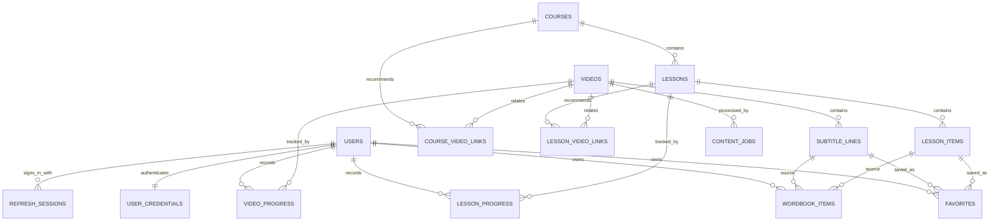

# 粤见 CantoScene｜数据库结构设计

> 文档状态：MVP 第一版  
> 日期：2026-08-08  
> 依赖文档：《02-MVP-PRD》《03-课程与内容规范》《04-信息架构与用户流程》《10-前端实现说明》  
> 用途：锁定后端数据库实体、关系、约束与权限，作为迁移脚本和 API 开发的依据

## 1. 技术基线

- 数据库：PostgreSQL 15+；
- 主键：UUID，由数据库或后端生成；
- 时间：全部使用 `timestamptz`，数据库统一保存 UTC；
- 视频和字幕时间：使用整数毫秒 `integer`，不使用浮点秒；
- 字形：内容层同时保存简体和香港繁体，粤拼单独保存；
- 媒体：数据库只保存 URL 或对象存储 key，不存储视频和音频二进制；
- 身份认证：用户表保存业务资料，密码由认证服务处理，业务表不保存明文或可逆密码；
- 部署适配：可使用 Supabase Postgres、Neon Postgres、RDS PostgreSQL 或自建 PostgreSQL。

本地开发可使用项目内置的 PGlite PostgreSQL 兼容环境免安装启动；它只替代本地数据库进程，不改变 Prisma schema、迁移 SQL 或生产数据库选型。

## 2. 设计决策

1. **内容数据与用户数据分离**：课程、视频、字幕是公共内容；收藏、生词本、进度是用户私有数据。
2. **课程内容使用结构化 JSONB**：课节中的字词、例句、对话和小练习形态不同，统一放入 `lesson_items.content`，但由 API 层按 `item_type` 做严格校验。
3. **字幕独立成表**：每句字幕可单独定位、校对、收藏和回到原视频。
4. **AI 输出不直接发布**：DeepSeek 处理后的内容标记为 `ai_draft`，不覆盖已审核内容。
5. **收藏和生词本分开**：收藏保留整句台词或课程内容；生词本保留用户想复习的单词或短语。
6. **课程总进度不重复存储**：由课节进度实时汇总，避免多份数据不一致。

## 3. 实体关系



## 4. 核心表

### 4.1 `users`：用户业务资料

| 字段 | 类型 | 约束 | 说明 |
|---|---|---|---|
| `id` | uuid | PK | 与认证系统的用户 ID 一致 |
| `email` | text | unique, nullable | 邮箱登录时保存，第三方登录可暂空 |
| `display_name` | varchar(80) | not null | 昵称 |
| `role` | varchar(20) | not null | `learner` / `editor` / `admin` |
| `script_preference` | varchar(20) | not null | `simplified` / `traditional`，默认 `simplified` |
| `created_at` | timestamptz | not null | 创建时间 |
| `updated_at` | timestamptz | not null | 最后更新时间 |

### 4.2 `courses`：课程单元

| 字段 | 类型 | 约束 | 说明 |
|---|---|---|---|
| `id` | uuid | PK | 课程 ID |
| `slug` | varchar(100) | unique, not null | URL 标识，如 `cha-chaan-teng` |
| `position` | integer | not null | 展示顺序 |
| `title_simplified` | text | not null | 简体标题 |
| `title_traditional` | text | not null | 香港繁体标题 |
| `summary_simplified` | text | not null | 简体简介 |
| `summary_traditional` | text | not null | 繁体简介 |
| `cover_url` | text | nullable | 封面资源 |
| `difficulty` | varchar(20) | not null | `starter` / `beginner` / `intermediate` / `advanced` |
| `estimated_minutes` | integer | not null | 预计学习时间 |
| `status` | varchar(20) | not null | `draft` / `published` / `archived` |
| `published_at` | timestamptz | nullable | 发布时间 |
| `created_at`, `updated_at` | timestamptz | not null | 审计时间 |

### 4.3 `lessons`：课节

| 字段 | 类型 | 约束 | 说明 |
|---|---|---|---|
| `id` | uuid | PK | 课节 ID |
| `course_id` | uuid | FK courses, not null | 所属课程 |
| `slug` | varchar(100) | not null | 课程内唯一 URL 标识 |
| `position` | integer | not null | 课程内顺序 |
| `title_simplified`, `title_traditional` | text | not null | 课节标题 |
| `summary_simplified`, `summary_traditional` | text | not null | 课节简介 |
| `goal_simplified`, `goal_traditional` | text | not null | 学习目标，可在页面中单独展示 |
| `estimated_minutes` | integer | not null | 预计时长 |
| `status` | varchar(20) | not null | `draft` / `published` / `archived` |
| `created_at`, `updated_at` | timestamptz | not null | 审计时间 |

唯一约束：`(course_id, slug)` 和 `(course_id, position)`。

### 4.4 `lesson_items`：课节内容项

| 字段 | 类型 | 约束 | 说明 |
|---|---|---|---|
| `id` | uuid | PK | 内容项 ID |
| `lesson_id` | uuid | FK lessons, not null | 所属课节 |
| `stage` | varchar(20) | not null | `intro` / `words` / `patterns` / `dialogue` / `quiz` / `summary` |
| `item_type` | varchar(30) | not null | `intro` / `character` / `phrase` / `dialogue` / `tip` |
| `position` | integer | not null | 课节内排序 |
| `content` | jsonb | not null | 经 API schema 校验的内容 |
| `audio_url` | text | nullable | Fish Audio 离线生成后的静态音频 |
| `status` | varchar(20) | not null | `draft` / `ai_draft` / `reviewed` / `published` |
| `created_at`, `updated_at` | timestamptz | not null | 审计时间 |

`character` 或 `phrase` 类型的 `content` 最少包含：

```json
{
  "code": "A1",
  "cantonese_simplified": "冻",
  "cantonese_traditional": "凍",
  "jyutping": "dung3",
  "meaning_simplified": "冷的；加冰的",
  "meaning_traditional": "冷的；加冰的",
  "example": {
    "cantonese_simplified": "唔该，冻柠茶少甜。",
    "cantonese_traditional": "唔該，凍檸茶少甜。",
    "jyutping": "m4 goi1, dung3 ning4 caa4 siu2 tim4.",
    "mandarin_simplified": "麻烦来一杯少甜的冰柠檬茶。"
  }
}
```

### 4.5 `videos`：影视内容

| 字段 | 类型 | 约束 | 说明 |
|---|---|---|---|
| `id` | uuid | PK | 视频 ID |
| `slug` | varchar(120) | unique, not null | URL 标识 |
| `title_simplified`, `title_traditional` | text | not null | 学习页标题 |
| `list_title_simplified`, `list_title_traditional` | text | not null | 列表卡标题 |
| `summary_simplified`, `summary_traditional` | text | not null | 背景简介 |
| `difficulty` | varchar(20) | not null | `starter` / `beginner` / `intermediate` / `advanced` |
| `duration_ms` | integer | not null | 总时长毫秒 |
| `video_url` | text | not null | CDN 或对象存储地址 |
| `poster_url` | text | not null | 封面地址 |
| `tags` | text[] | not null | 场景标签 |
| `focus_points` | jsonb | not null | 本段学习重点 |
| `source_note` | text | nullable | 素材来源备注，仅编辑可见 |
| `status` | varchar(20) | not null | `draft` / `processing` / `review` / `published` / `archived` |
| `published_at` | timestamptz | nullable | 发布时间 |
| `created_at`, `updated_at` | timestamptz | not null | 审计时间 |

检查约束：`duration_ms > 0`。

### 4.6 `course_video_links`：课程与视频关联

| 字段 | 类型 | 约束 | 说明 |
|---|---|---|---|
| `course_id` | uuid | FK courses | 课程 |
| `video_id` | uuid | FK videos | 视频 |
| `relation_type` | varchar(20) | not null | `recommended` / `practice` / `related` |
| `position` | integer | not null | 推荐顺序 |

主键：`(course_id, video_id)`。

### 4.7 `lesson_video_links`：课节与视频关联

| 字段 | 类型 | 约束 | 说明 |
|---|---|---|---|
| `lesson_id` | uuid | FK lessons | 课节 |
| `video_id` | uuid | FK videos | 视频 |
| `relation_type` | varchar(20) | not null | `practice` / `example` / `related` |
| `position` | integer | not null | 课节内推荐顺序 |

主键：`(lesson_id, video_id)`。课程级推荐和具体课节练习分别保存，避免前端只能把视频挂在整个课程下。

### 4.8 `subtitle_lines`：逐句字幕

| 字段 | 类型 | 约束 | 说明 |
|---|---|---|---|
| `id` | uuid | PK | 字幕句 ID |
| `video_id` | uuid | FK videos, not null | 所属视频 |
| `position` | integer | not null | 视频内句序 |
| `start_ms` | integer | not null | 开始毫秒 |
| `end_ms` | integer | not null | 结束毫秒 |
| `speaker` | varchar(80) | nullable | 说话人 |
| `text_simplified` | text | not null | 默认显示文本 |
| `text_traditional` | text | not null | 香港繁体原文 |
| `jyutping` | text | nullable | 粤拼 |
| `mandarin_simplified` | text | nullable | 普通话简体释义 |
| `mandarin_traditional` | text | nullable | 普通话繁体释义 |
| `review_status` | varchar(20) | not null | `draft` / `ai_draft` / `reviewed` / `published` |
| `asr_confidence` | numeric(5,4) | nullable | 语音识别置信度 |
| `ai_model` | varchar(100) | nullable | 生成初稿的模型标识 |
| `audio_url` | text | nullable | 可选独立句音频；为空时截取原视频重播 |
| `reviewed_by` | uuid | FK users, nullable | 审核人 |
| `reviewed_at` | timestamptz | nullable | 审核时间 |
| `created_at`, `updated_at` | timestamptz | not null | 审计时间 |

约束：

- 唯一 `(video_id, position)`；
- `start_ms >= 0`；
- `end_ms > start_ms`；
- `end_ms <= videos.duration_ms + 2000`，该项由后端校验；
- 只有 `published` 字幕对普通用户可见；当视频整体处于预览状态时，编辑可查看草稿。

### 4.9 `favorites`：用户收藏

| 字段 | 类型 | 约束 | 说明 |
|---|---|---|---|
| `id` | uuid | PK | 收藏 ID |
| `user_id` | uuid | FK users, not null | 所属用户 |
| `subtitle_line_id` | uuid | FK subtitle_lines, nullable | 影视台词来源 |
| `lesson_item_id` | uuid | FK lesson_items, nullable | 课程内容来源 |
| `learning_status` | varchar(20) | not null | `saved` / `learning` / `mastered` / `archived` |
| `note` | text | nullable | 用户备注 |
| `created_at`, `updated_at` | timestamptz | not null | 审计时间 |

约束：

- `subtitle_line_id` 与 `lesson_item_id` 必须且只能有一个非空；
- 部分唯一索引 `(user_id, subtitle_line_id)`；
- 部分唯一索引 `(user_id, lesson_item_id)`；
- 一句台词或一个课程内容对同一用户只保留一个有效收藏。

### 4.10 `wordbook_items`：用户生词本

| 字段 | 类型 | 约束 | 说明 |
|---|---|---|---|
| `id` | uuid | PK | 生词项 ID |
| `user_id` | uuid | FK users, not null | 所属用户 |
| `normalized_key` | varchar(200) | not null | 去空格后的繁体词形，用于去重 |
| `term_simplified`, `term_traditional` | text | not null | 词或短语 |
| `jyutping` | text | nullable | 粤拼 |
| `mandarin_simplified`, `mandarin_traditional` | text | nullable | 普通话释义 |
| `example_simplified`, `example_traditional` | text | nullable | 粤语例句 |
| `example_jyutping` | text | nullable | 例句粤拼 |
| `audio_url` | text | nullable | 可选静态发音音频 |
| `subtitle_line_id` | uuid | FK subtitle_lines, nullable | 可选影视来源 |
| `lesson_item_id` | uuid | FK lesson_items, nullable | 可选课程来源 |
| `learning_status` | varchar(20) | not null | `saved` / `learning` / `mastered` / `archived` |
| `note` | text | nullable | 用户备注 |
| `created_at`, `updated_at` | timestamptz | not null | 审计时间 |

唯一约束：`(user_id, normalized_key)`。来源可以为空，为以后手动添加生词保留空间。

### 4.11 `lesson_progress`：课节进度

| 字段 | 类型 | 约束 | 说明 |
|---|---|---|---|
| `user_id` | uuid | FK users | 用户 |
| `lesson_id` | uuid | FK lessons | 课节 |
| `status` | varchar(20) | not null | `not_started` / `in_progress` / `completed` |
| `progress_percent` | smallint | not null | 0–100 |
| `last_item_id` | uuid | FK lesson_items, nullable | 最后学习位置 |
| `started_at` | timestamptz | nullable | 首次开始 |
| `updated_at` | timestamptz | not null | 最后学习 |
| `completed_at` | timestamptz | nullable | 完成时间 |

主键：`(user_id, lesson_id)`。检查：`progress_percent BETWEEN 0 AND 100`。

### 4.12 `video_progress`：视频进度

| 字段 | 类型 | 约束 | 说明 |
|---|---|---|---|
| `user_id` | uuid | FK users | 用户 |
| `video_id` | uuid | FK videos | 视频 |
| `status` | varchar(20) | not null | `not_started` / `in_progress` / `completed` |
| `last_position_ms` | integer | not null | 上次播放位置 |
| `started_at` | timestamptz | nullable | 首次播放 |
| `updated_at` | timestamptz | not null | 最后播放 |
| `completed_at` | timestamptz | nullable | 完成时间 |

主键：`(user_id, video_id)`。`last_position_ms` 必须在 0 和视频时长之间，由后端同步校验。

### 4.13 `content_jobs`：内容生产任务

该表用于跟踪本地转写、DeepSeek 字幕补全和 Fish Audio 离线音频生成。

| 字段 | 类型 | 约束 | 说明 |
|---|---|---|---|
| `id` | uuid | PK | 任务 ID |
| `job_type` | varchar(30) | not null | `transcribe` / `subtitle_enrich` / `tts` |
| `video_id` | uuid | FK videos, nullable | 视频类任务目标 |
| `lesson_id` | uuid | FK lessons, nullable | 课程类任务目标 |
| `provider` | varchar(50) | not null | `local_whisper` / `deepseek` / `fish_audio` |
| `status` | varchar(20) | not null | `queued` / `running` / `succeeded` / `failed` / `cancelled` |
| `input_hash` | varchar(64) | nullable | 防止重复处理 |
| `result_summary` | jsonb | nullable | 成功数、失败数等非敏感摘要 |
| `error_code` | varchar(80) | nullable | 稳定错误码 |
| `error_message` | text | nullable | 编辑可见的错误摘要 |
| `created_by` | uuid | FK users, not null | 发起人 |
| `created_at`, `updated_at`, `finished_at` | timestamptz | | 任务时间 |

DeepSeek API Key 和 Fish Audio API Key 不得进入该表、任务结果或日志。

### 4.14 `user_credentials`：本地登录凭证

| 字段 | 类型 | 约束 | 说明 |
|---|---|---|---|
| `user_id` | uuid | PK, FK users | 对应用户 |
| `password_hash` | text | not null | scrypt 随机盐密码摘要，不保存明文 |
| `created_at`, `updated_at` | timestamptz | not null | 审计时间 |

该表属于认证边界，不由普通业务查询返回。后续改用托管认证时可以迁移或移除，不影响 `users` 业务资料。

### 4.15 `refresh_sessions`：刷新会话

| 字段 | 类型 | 约束 | 说明 |
|---|---|---|---|
| `id` | uuid | PK | 会话 ID |
| `user_id` | uuid | FK users | 所属用户 |
| `token_hash` | varchar(64) | unique | 刷新令牌 SHA-256 摘要 |
| `expires_at` | timestamptz | not null | 过期时间 |
| `revoked_at` | timestamptz | nullable | 撤销时间 |
| `created_at` | timestamptz | not null | 创建时间 |

原始刷新令牌只放在 HttpOnly Cookie 中；数据库只保存摘要，并在刷新时轮换。

## 5. 关键索引

```sql
CREATE INDEX idx_lessons_course_position
  ON lessons(course_id, position);

CREATE INDEX idx_lesson_items_lesson_position
  ON lesson_items(lesson_id, position);

CREATE INDEX idx_lesson_video_links_position
  ON lesson_video_links(lesson_id, position);

CREATE INDEX idx_videos_status_published
  ON videos(status, published_at DESC);

CREATE UNIQUE INDEX uq_subtitle_video_line
  ON subtitle_lines(video_id, position);

CREATE INDEX idx_subtitle_video_time
  ON subtitle_lines(video_id, start_ms, end_ms);

CREATE UNIQUE INDEX uq_favorite_user_subtitle
  ON favorites(user_id, subtitle_line_id)
  WHERE subtitle_line_id IS NOT NULL;

CREATE UNIQUE INDEX uq_favorite_user_lesson_item
  ON favorites(user_id, lesson_item_id)
  WHERE lesson_item_id IS NOT NULL;

CREATE UNIQUE INDEX uq_wordbook_user_term
  ON wordbook_items(user_id, normalized_key);

CREATE INDEX idx_video_progress_recent
  ON video_progress(user_id, updated_at DESC);

CREATE INDEX idx_lesson_progress_recent
  ON lesson_progress(user_id, updated_at DESC);
```

## 6. 删除策略

- 已发布课程、视频和字幕默认不物理删除，使用 `archived`；
- 删除草稿课程时，可级联删除未发布课节与内容项；
- 用户取消收藏可物理删除 `favorites`，客户端撤销由短时状态处理；
- 删除用户时，其收藏、生词本和进度级联删除；
- 公共内容不因某个用户删除而受影响。

## 7. 权限边界

### 7.1 游客

- 只读取 `published` 的课程、课节、视频和字幕；
- 不能访问任何用户私有表。

### 7.2 学习用户

- 只读取和修改自己的 `users`、`favorites`、`wordbook_items`、`lesson_progress`、`video_progress`；
- 不能写入公共内容表。

### 7.3 内容编辑

- 可创建和修改课程、视频、字幕草稿；
- 可发起 DeepSeek 和 Fish Audio 内容任务；
- 只有拥有发布权限的 `editor` 或 `admin` 可将内容改为 `published`。

### 7.4 管理员

- 管理用户角色、内容状态和失败任务；
- 不通过普通管理页面查看用户密码、Token 或第三方 API Key。

## 8. 一致性规则

- 收藏和生词本写入采用数据库唯一约束 + upsert；
- 进度接口只允许当前用户更新自己的记录；
- 视频进度不得大于视频时长，课节进度不得大于 100；
- 字幕顺序以 `position` 为权威，时间轴调整后不改变字幕 ID，避免用户收藏失效；
- 发布视频前，后端检查其字幕时间有序且不超出视频时长；
- 已审核字幕调用 AI 补全时，仅写入新草稿或待审核字段，不静默覆盖。

## 9. MVP 数据迁移顺序

1. 用户与认证映射；
2. 课程、课节、课节内容项；
3. 视频、课程/课节关联、逐句字幕；
4. 收藏与生词本；
5. 课节进度与视频进度；
6. 内容生产任务与 DeepSeek/Fish Audio 服务封装。

## 10. 暂不纳入 MVP 的表

- 用户录音和发音评分；
- AI 自由对话记录；
- 社交、排行榜、积分与成就；
- 严格的间隔重复排期；
- 用户上传与内容审核队列；
- 版权授权合同管理。
